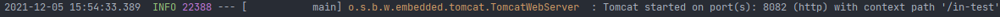

## 统一日志框架

+ 日志:
    1. 功能
        - 记录运行情况
        - 定位线上问题
    2. 组成:
        - 日志门面(日志抽象层)
        - 日志实现
> JavaBoot 使用 SLF4J + Logback 组合记录日志
>
> > 使用 SLF4J + Logback 组合记录日志时, 只要导入 SLF4J 和 Logback 的 Jar 包即可 (其他组合都需要导入相应的适配层的 Jar 包)

* 不同应用框架可能使用不同的日志框架,因此需要统一日志框架的使用.
    * (通用)步骤
        - 排除应用中原来的日志框架
        - 引入替换包替换被排除的日志框架
        - 导入SLF4J的实现
      > 替换包中包含被替换的日志框架中的所有类
    * SpringBoot 已经完成了统一日志框架中的2步(引入替换包;导入 SLF4J 的实现)
        * spring-boot-starter 引入了 spring-boot-starter-logging
      > spring-boot-starter-logging 的 Maven 依赖引入了
      >- logback-classic(包含日志框架 SLF4J 的实现)
      >- log4j-to-slf4j(log4j替换包)
      >- jul-to-slf4j(JUL替换包)
    * 实现排除其他应用框架所依赖的其他日志框架
```xml
<dependency>
    <groupId>org.apache.activemq</groupId>
    <artifactId>activemq-console</artifactId>
    <version>${activemq.version}</version>
    <exclusions>
        <exclusion>
            <groupId>commons-logging</groupId>
            <artifactId>commons-logging</artifactId>
        </exclusion>
    </exclusions>
</dependency>
```
---
## SpringBoot 日志配置及输出

+ 默认使用:
    - SLF4J + Logback 记录日志
    - 提供默认配置(可额外配)
        - 日志级别
        - 输出格式
+ 日志级别
    - trace 实际应用中很少使用;其他的使用都较多

| 序号  | 日志级别  |       说明       |
|:---:|:-----:|:--------------:|
|  1  | trace |   追踪(程序运行轨迹)   |
|  2  | debug | 调试(实际应用作为最低级别) |
|  3  | info  |      重要信息      |
|  4  | warn  |       警告       |
|  5  | error |      错误信息      |

+ 输出格式
    - 实例见SpringBootLoggingApplicationTests.java

| 序号  |            输出格式             |              说明               |
|:---:|:---------------------------:|:-----------------------------:|
|  1  | %d{yyyy-MM-dd HH:mm:ss,SSS} |         日志生产时间(输出到毫秒)         |
|  2  |          %-5level           |  日志级别(-5:左对齐并固定输出5个字符,不足添0)   |
|  3  |        %logger / %c         |           logger 名称           |
|  4  |        %thread / %t         |            当前线程名称             |
|  5  |             %p              |            日志输出格式             |
|  6  |    %message / %msg / %m     | 日志内容(即 logger.info("message") |
|  7  |             %n              |              换行符              |
|  8  |         %class / %C         |            Java类名             |
|  9  |         %file / %F          |              文件名              |
| 10  |             %L              |             错误行号              |
| 11  |        %method / %M         |              方法名              |
| 12  |             %l              |     语句在行数(含类名 方法名 文件名 行数)     |
| 13  |          hostName           |             本地机器名             |
| 14  |         hostAddress         |            本地ip地址             |

SpringBoot 日志输出内容默认包括:
* 时间日期
* 日志级别
* 进程ID
* 分隔符: ---
* 线程名: 方括号内的(可能会阶段控制台输出)
* Logger名称
* 日志内容



### 修改默认日志配置
* 通过全集配置文件(application.properties/yml)修改SpringBoot日志级别和显示格式等默认配置
    * 详见 [application.properties](../src/main/resources/application.properties)

* 自定义日志配置
    * 上述对日志的修改只能修改个别日志配置
    * 更多修改和使用高级功能需要通过日志实现框架的配置文件进行配置
  > Spring 官方提供了各个日志实现框架所需的配置文件,用户只要将指定的配置文件放置到项目的类路径下即可.
    * 日志框架的配置文件分类:
        * 普通日志配置文件 (Logback: logback.xml logback.groovy Log4j2: log4j2.xml JUL: logging.properties)
        * 带有spring标识的日志配置文件 (Logback: logback-spring.xml logback-spring.groovy Log4j2: log4j2-spring.xml)
    * 普通日志配置文件
        * 放在项目的类路径下,普通日志配置文件将跳过 SpringBoot, 直接被日志框架加载
    * 带有Spring标识的日志配置文件
        * SpringBoot推荐使用
        * 放在项目的类路径下,不会直接被日志框架加载,而是由SpringBoot对它们进行解析,而是SpringBoot对其进行解析(可以使用SpringBoot的高级功能Profile,实现在不同环境下使用不同的日志配置)
        * 详见 [logback-spring.xml](../src/main/resources/logback-spring.xml)
        * Profile 只要再总配置文件中设置即可

---
---