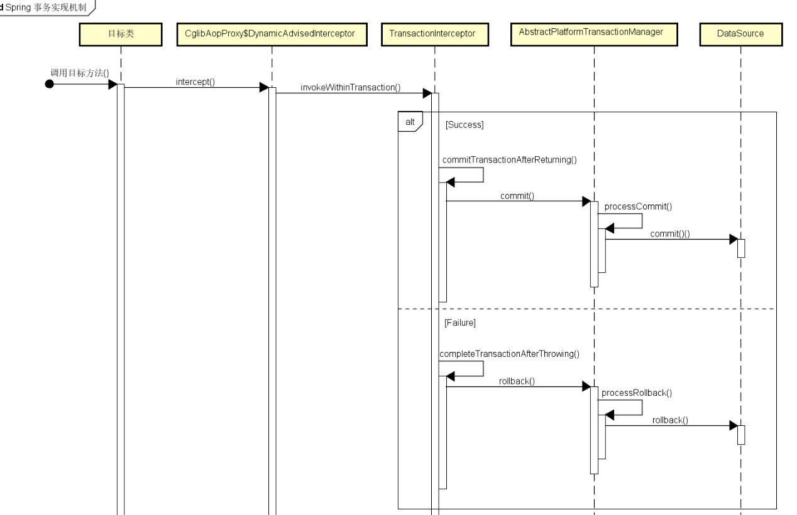

# SpringBoot Transaction 事务管理

+ Spring 提供两种事务管理模式

  1. 声明式: 基于 AOP, 将具体业务逻辑和事务处理解耦

     > 业务中用得多

  2. 编程式: 编码实现

+ 声明式事务管理实现方式

  1. 配置文件中声明
  2. `@Transactional` 注解声明

> 默认配置下, Spring 只会回滚, 且只会 **Unchecked Exception 非检查异常**(即 RuntimException及其子类 & Error) 进行回滚
>
> @Transactional 注解只能使用在 **public** 方法或者类上才有效
>
> > 因此不能在接口上使用 @Transactional 注解
>
> 建议只在**方法上**使用 @Transactional 注解, 在类上使用将对类的所有方法都创建事务.(对查询使用将影响效率)
>
> 使用了@Transactional的方法，对同一个类里面的方法调用， @Transactional无效。比如有一个类Test，它的一个方法A，A再调用Test本类的方法B（不管B是否public还是private），但A没有声明注解事务，而B有。则外部调用A之后，B的事务是不会起作用的。（经常在这里出错）
>
> > Class A 中 Method X & Y, Class B 中 Method Z(X 调用 Y, Z 调用 X; Y & Z 有 @Transactional 注解标注):  调用 X, Y 将创建事务; 但是, 调用 Z, Y 不会创建事务
>
> spring的事务在抛异常的时候会回滚，如果是**catch捕获了，事务无效**。可以在catch里面加上throw new RuntimeException().
>
> **和锁同时使用需要注意**：由于Spring事务是通过AOP实现的，所以在方法执行之前会有开启事务，之后会有提交事务逻辑。而synchronized代码块执行是在事务之内执行的，可以推断在synchronized代码块执行完时，事务还未提交，其他线程进入synchronized代码块后，读取的数据不是最新的。
>
> > 必须**使synchronized锁的范围大于事务控制的范围**，把synchronized加到Controller层或者大于事务边界的调用层！

+ SpringBoot 配置了数据源(DataSource), 将会自动配置 `DataSourceTransactionManager`, 因此只需要在方法或类上使用 @Transactional 注解, 就自动纳入到了 Spring 的事务管理

## 简单使用

+ 在 方法/类上 添加 @Transactional 注解即可

  ```java
  @Transactional(propagation = Propagation.REQUIRED)
  @Override
  public void save() {
  	Persion p = new Person("Name");
      persionMapper.insert(p);
      if (true) {
          throw new RuntimeException("Message");
      }
  }
  ```

  > 上述代码表示向数据库中插入一个人的信息, 但是由于 if 语句抛出的 RuntimeException, 事务将回滚, 数据不会被插入到数据库中.

## @Transactional 注解的属性

+ value & transactionManager 

  > 含义一样, 即配置了多个事务管理器时, 使用此属性指定使用哪个事务管理器

+ propagation

  > 事务的传播行为(默认值: Propagation.REQUIRED)

  + 可选值

    - Propagation.REQUIRED (默认)

      如果当前存在事务，则加入该事务，如果当前不存在事务，则创建一个新的事务。

      > 有则加入, 无则创建

      + **配置了注解的方法A**调用**没有配置注解的方法B**时, 自动将B加入到A的事务中

      ```java
      @Service
      public class ServiceImpl implements Service {
          @Autowired
          private Mapper mapper;
          @Transactional(propagation = Propagation.REQUIRED)
          @Override
          public void method1() {
              method2();
              
              Data data1 = new Data(1);
              mapper.insert(data1);
              if (true)
                  throw new RuntimeException("Message");
          }
          
          public void method2() {
              Data data2 = new Data(2);
              mapper.insert(data2);
          }
      }
      ```

      > 上述代码, 若执行 method1() 同时将执行 method2(), 由于 if 语句抛出 RuntimeException, 最终的两条数据都不会加入到数据库中.
      >
      > 但是如果: method2() 抛出异常, method1() catch 处理掉了, 这将会报 `UnexpetedRollbackException`.
      >
      > > method2() 的事务仍为应该回滚, 但 method1() 处理了异常, 正常执行到了方法尾, 因此 method1() 的事务认为应该提交事务. 同一个类中的两个事务的处理结果的不一致导致异常的产生.

    - Propagation.SUPPORTS

      如果当前存在事务，则加入该事务；如果当前不存在事务，则以非事务的方式继续运行。

      > 有则加入, 无则继续(不以事务的形式继续)

    - Propagation.MANDATORY

      如果当前存在事务，则加入该事务；如果当前不存在事务，则抛出异常。

      > 有则加入, 无则抛错

    - Propagation.REQUIRES_NEW

      重新创建一个新的事务，如果当前存在事务，暂停当前的事务。

      > 有则暂停, 然后创建一个新的
      >
      > 没有直接创建一个新的

      + 类比 Propagation.REQUIRED 的例子代码, 若在 method2() 上添加 `@Transactional(propagation = Propagation.REQUIRES_NEW)` 注解, 也不能阻止事务的回滚

        > 意思是, method1() 调用的事务, 被 method2() 新建的事务给停掉了, 然后 method2() 又新建一个事务, 这样实现 **method1() 的插入失效, 而 method2() 的插入成功.**
        >
        > 但是实际结果是: method1() & method2() 的事务都被回滚.
        >
        > Spring 的事务拦截器对同一个类的方法内部调用时, 不会拦截(即 类比是该属性值(Propagation.REQUIRES_NEW) 并不会新建一个事务, 而是沿用原来的事务继续执行).只有被外部调用时, Spring 的事务拦截器才会拦截, 然后新建一个事务
        >
        > [Spring文档](https://docs.spring.io/spring/docs/4.3.13.RELEASE/spring-framework-reference/htmlsingle/#transaction-declarative-annotations)
        >
        > **简单说: ** class A 中的 方法 x y, x 调用 y, 即使 y 的事务处理 Propagation.REQUIRES_NEW 也不会新建一个事务, er class B 中的 方法 z 被 x 调用时 (z 的事务处理为 Propagation.REQUIRES_NEW), z 的事务将停止 x 的事务, 然后新建.

        + 解决办法: 

          1. 使用 AspectJ 取代 Spring AOP 代理

          2. 新建一个类, 将 method1() 调用的 method2() 写在新建的类中, 然后 method1() 调用 新建类中的 method2(), 才实现了该属性值的功能

    - Propagation.NOT_SUPPORTED

      以非事务的方式运行，如果当前存在事务，暂停当前的事务。

      > 有则暂停, 然后以非事务的形式继续
      >
      > 没有直接以非事务的形式继续

    - Propagation.NEVER

      以非事务的方式运行，如果当前存在事务，则抛出异常。

      > 有事务运行则抛出异常
      >
      > 没有则继续以非事务的形式运行

    - Propagation.NESTED

      和 Propagation.REQUIRED 效果一样。

      > 类默认属性

+ isolation

  > 事务隔离级别(默认值: Isolation.DEFAULT)

  + 可选值

    - Isolation.DEFAULT (默认)

      使用**底层数据库默认**的隔离级别。

    - Isolation.READ_UNCOMMITTED

    - Isolation.READ_COMMITTED

    - Isolation.REPEATABLE_READ

    - Isolation.SERIALIZABLE

+ timeout

  > 事务的超时时间(默认: -1)
  >
  > 超时了, 事务还未完成, 则自动回滚事务

+ readOnly

  > 指定事务为可读事务(默认: false)
  >
  > 为了忽视不用事务的方法(读取数据 等不对数据库内容进行操作的), 可以设置为 true

+ rollbackFor

  > 指定**触发事务**回滚的异常类型(可指定多个)

+ noRollbackFor

  > 指定**不触发**事务回滚的异常类型(可指定多个)

## @Transactional 事务实现机制

+ 使用 `@Transactional` 注解时, Spring Framework 就默认使用 AOP 代理, 在代码被调用时自动生成代理对象.

  > Spring AOP 代理:
  >
  > 1. CglibAopProxy
  >
  >    > 调用其内部类`DynamicAdviseInterceptor`的 intercept 方法
  >
  >    
  >
  > 2. JdkDynamicAopProxy
  >
  >    > 调用 invoke 方法

+ 代理对象根据 `@Transactional` 注解的属性配置, 决定注解的标注方法是否被拦截器 `TransactionInterceptor` 拦截

+ `TransactionInterceptor` 拦截时, 将在标注方法被执行前创建或者加入事务, 再执行标注方法的业务逻辑.

+ 最后, 根据执行情况是否出现异常, 决定是否调用抽象事物管理器 `AbstractPlatformTransactionManager` 操作数据源 `DataSource` 提交或回滚事务.

  > 事务管理的框架是由抽象事务管理器 `AbstractPlatformTransactionManager` 来提供的，而具体的底层事务处理实现，由 `PlatformTransactionManager` 的具体实现类来实现，如事务管理器 `DataSourceTransactionManager`。不同的事务管理器管理不同的数据资源 `DataSource`，比如 `DataSourceTransactionManager` 管理 JDBC 的 `Connection`。